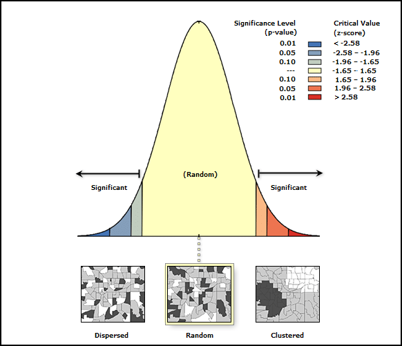
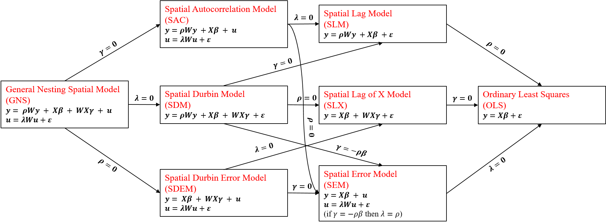

# **Spatial Regression**

**Instructors:**\
Yuan Chai ([chaix026\@umn.edu](mailto:chaix026@umn.edu){.email})\
Ali Joglekar ([joglekar\@umn.edu](mailto:joglekar@umn.edu){.email})

------------------------------------------------------------------------

## Method of Delivery

-   Workshop text, images and R code are all contained within a R
    Markdown file hosted on the GEMS Informatics Platform. You do not
    need to have R or RStudio installed on your machine to participate
-   A recording of the workshop will be posted on Canvas
-   Please download any desired materials, as we cannot guarantee access
    to the Canvas course beyond 3 months.

------------------------------------------------------------------------

## Module Outline:

-   [Spatial Dependence](#SpDep)
    -   [Exercise 1](#Ex1)
-   [Spatial Weight Objects](#SpWt)
    -   [Exercise 2](#Ex2)
-   [Spatial Autocorrelation](#SpAuto)
    -   [Exercise 3](#Ex3)
-   [Spatial Regression](#SpReg)
    -   [Exercise 4](#Ex4)

------------------------------------------------------------------------

## **Load R Libraries**

```{r}
# Install and load packages needed for this workshop

packages_to_load <- c("sf", "spdep", "spatialreg", "tmap")

for ( package in packages_to_load ) {
    # Check if package is already installed, if not, install and load the package
    if (!require(package, character.only=T, quietly=T, warn.conflicts=F)) {
        install.packages(package)
        suppressPackageStartupMessages(library(package, character.only=T, quietly=T, warn.conflicts=F))
    }
}

```

[Note: For your own work, once packages are installed, it is recommended
to just use library() to load your packages]{style="color:Green"}

    # Spatial data libraries
    library(terra)
    library(sf)
    library(spdep)

    # Spatial regression libraries
    library(spatialreg)

    # Plotting libraries
    library(tmap)

------------------------------------------------------------------------

## Data

For this workshop, a pseudo dataset representing hypothetical pest
stress for selected Minnesota counties are created and saved in the
directory `./data/shp/mnp`.\
For the hands-on exercises, you will be using a dataset downloaded from
the Malawi Living Standard Measurement Survey Integrated Household
Sample (LSMS-IHS) Data Wave 5 Data (available from
<https://microdata.worldbank.org/index.php/catalog/3818> ). The data has
been downloaded, cleaned, transformed, and saved in the directory
`./data/shp/MWI`.

### Attribution

The following material draws heavily from [Spatial Data
Science](https://rspatial.org/raster/analysis/3-spauto.html) and some
other online souces ([link
1](http://www.econ.uiuc.edu/~lab/workshop/Spatial_in_R.html), [link
2](https://www.r-bloggers.com/2019/09/spatial-regression-in-r-part-1-spamm-vs-glmmtmb/),
[link 3](https://rpubs.com/quarcs-lab/tutorial-spatial-regression)).

## **Spatial Dependence** {#SpDep}

When dealing with space, one must bear in mind Tobler's first law of
geography

> **"Everything is related to everything else, but close things are more
> related than things that are far apart"**\
> --Tobler (1979)

**Example**

Pest pressure for Minnesota, notice how the pest pressure are not
randomly distributed across the study area


**Basic Steps** for answering spatial regression problems:

1.  Decide how points/polygons are linked in space (and time)
2.  Specify a spatial weights matrix
3.  Run OLS
4.  Check for spatial autocorrelation (residual)
5.  Run spatial regression

In this workshop we'll introduce you to these basic steps, including
specification of spatial dependence, specification tests to detect
spatial dependence in regressions models and basic regression models
that incorporate spatial dependence.

### **Measuring spatial association and correlation**

An important step in spatial statistics and modelling is to get a
measure of the spatial influence between geographic objects.\
This can be expressed as a function of *adjacency*, *closeness* or
*(inverse) distance*, and is often expressed as a spatial weights
matrix.

### **Neighbor Criterion**

The specification of the neighboring set is quite arbitrary and there's
a wide range of suggestions in the literature.

In `spdep` package, neighbor relationships between *n* observations are
represented by an `nb` object class

#### **Contiguity-based neighbors:**

Neighboring polygons "touch" a focal polygon


1.  **Rook criterion**: neighboring polygons must share a line segment
    with focal polygon\
2.  **Queen criterion**: neighboring polygons must share a vertex with
    focal polygon

#### **Distance-based neighbors:**

Neighboring polygons within a given proximity threshold to a focal
polygon

1.  **K-nearest neighbors** retains K nearest neighbors for each focal
    polygon
2.  **Neighborhood contiguity by distance** retains the neighbors for
    each focal polygon within a fixed distance band

**Note:** Distances are measured between polygon centroids.\
If your data are in geographic coordinate system, you can supply the
argument `longlat = TRUE` to use great circle distances

**Example:** Pest pressure (hypothetical dataset) for selected Minnesota
counties

```{r}
# read in our example shape file: pest pressure for selected MN counties
mnp <- st_read("./data/shp/mnp")
mnp <- st_as_sf(mnp)
str(mnp)
```

```{r}
# plot the PEST variable

tm_shape(mnp) +
tm_polygons(col="PEST", border.col="grey50", lwd=.4)
```

```{r}
# calculate neighboring using Queen's case (default) 
mnp_nbq <- poly2nb(mnp, queen=TRUE)
mnp_nbq
```

```{r}
# structure of a spatial neighbor object
str(mnp_nbq)
```

```{r}
# quick plot
plot(mnp$geometry, border = "grey60")
plot(mnp_nbq, st_coordinates(st_centroid(st_geometry(mnp))), add=T)
```

```{r}
# calculate neighboring using Rook's case
mnp_nbr <- poly2nb(mnp, queen=FALSE)
mnp_nbr
```

```{r}
# K-nearest neighbors
mnp_nbk <- knn2nb(knearneigh(st_centroid(st_geometry(mnp)), k=3))
mnp_nbk
```

```{r}
# Neighborhood continuity by distance
mnp_nbd <- dnearneigh(st_centroid(st_geometry(mnp)), d1 = 0, d2 = 100000) # neighbors within 100 km
mnp_nbd
```

```{r}
# Plot
par(mfrow = c(2, 2))
par(mai=c(0,0,0.2,0))

plt_coord <- st_coordinates(st_centroid(st_geometry(mnp)))

plot(mnp$geometry, border = "grey60", main = "Queen's Case Contiguity")
plot(mnp_nbq, plt_coord, pch = 19, cex = 0.6, col="red", add = TRUE)

plot(mnp$geometry, border = "grey60", main = "Rook's Contiguity")
plot(mnp_nbr, plt_coord, pch = 19, cex = 0.6, col="red", add = TRUE)

plot(mnp$geometry, border = "grey60", main = "K-nearest Neighbors")
plot(mnp_nbk, plt_coord, pch = 19, cex = 0.6, col="red", add = TRUE)

plot(mnp$geometry, border = "grey60", main = "Distance")
plot(mnp_nbd, plt_coord, pch = 19, cex = 0.6, col="red", add = TRUE)
```

### [**Exercise 1: Calculating neighbor objects**]{style="color:Green"} {#Ex1}

In this exercise, we will first read in a shape file which contains the
Malawi LSMS data and then create various neighbor objects.

**Step 1:** Use the `st_read()` function to read in shape file from the
`'./data/shp/MWI/` directory.

```{r}
# Your answer

```

------------------------------------------------------------------------

**Step 2:** Calculate a neighbor object for Malawi using the queen's
case, rook's case, k-nearest neighbor & distance.

> Note, your Malawi object has a long/lat projection, so you want to
> look up the long/lat argument in distance-based metrics.

```{r}
# Your answer

```

------------------------------------------------------------------------

**Step 3:** Print your neighbor objects or use the `summary()` function
to explore these objects. What differences do you see?

```{r}
# Your answer

```

------------------------------------------------------------------------

**Step 4:** Plot your neighbor objects to explore these objects. What
differences do you see?

```{r}
# Your answer

```

------------------------------------------------------------------------

    # Possible answer:

    # Step 1: 
    # Read MWI shape file
    mwi_sf <- st_read("./data/shp/MWI") #shapefiles called only using data source name (dsn)
    mwi_sf


    # Step 2: 
    #neighbor objects
    #-------------
    mwi_nbq <- poly2nb(mwi_sf) #queen's case by default
    mwi_nbr <- poly2nb(mwi_sf, queen = FALSE) #rook's case
    mwi_nbk <- knn2nb(knearneigh(st_centroid(st_geometry(mwi_sf)), k = 3)) #3 nearest neighbors
    mwi_nbd <- dnearneigh(st_centroid(st_geometry(mwi_sf)), d1 = 0, d2 = 1, longlat = TRUE) #neighbors within 1 degree

    # Step 3: 
    summary(mwi_nbq)
    summary(mwi_nbr)
    summary(mwi_nbk)
    summary(mwi_nbd)


    # Step 4:
    par(mfrow = c(1, 4))
    par(mar=c(0,0,2,0))

    mwi_coord <- st_coordinates(st_centroid(st_geometry(mwi_sf)))

    plot(mwi_sf$geometry, border = "grey60", main = "Queen's Case Contiguity")
    plot(mwi_nbq, mwi_coord, pch = 19, cex = 0.6, col="red", add = TRUE)

    plot(mwi_sf$geometry, border = "grey60", main = "Rook's Contiguity")
    plot(mwi_nbr, mwi_coord, pch = 19, cex = 0.6, col="red", add = TRUE)

    plot(mwi_sf$geometry, border = "grey60", main = "K-nearest Neighbors")
    plot(mwi_nbk, mwi_coord, pch = 19, cex = 0.6, col="red", add = TRUE)

    plot(mwi_sf$geometry, border = "grey60", main = "Distance")
    plot(mwi_nbd, mwi_coord, pch = 19, cex = 0.6, col="red", add = TRUE)

## **Spatial Weight Objects** {#SpWt}

Spatial weights are a list of weights indexed by a list of neighbors.

-   Useful to have a formalized way of evaluating spatial relationships
-   For a set of *n* units, each observation *i* can be potentially
    related to all the (*n* - 1) possible units
-   In practice we can usually assume that some interactions are more
    important than others
-   Often use a matrix to represent the connectivities between
    observations

If we know little about the assumed spatial process, we try to avoid
moving far from the binary representation of a weight of unity for
neighbors, and zero otherwise.

In `spdep` package, the `nb2listw` function takes a neighbors list
(`nb`) object and converts it into a weights (`listw`) object.

-   For `style="W"` (default), weights vary between 1 divided by the
    largest and smallest numbers of neighbors, and the sum of weights
    for each areal entity equal 1 (**row standardization**).

-   For `style="B"` -- 'binary' -- weights retain unity for each
    neighbor relationship, and the sum of weights for areas differ
    according to the numbers of neighbor areas have.

Conventionally we always have a 0 in the main diagonal in that each area
is not considered a neighbor to itself

**Example:** Creating Spatial Weight Objects

```{r}
# Spatial Weight Objects -- Row Standardized
mnp_lw_w <- nb2listw(mnp_nbq)
summary(mnp_lw_w)
```

```{r}
# structure of the Spatial Weight Objects
str(mnp_lw_w)
```

```{r}
# Summary of the weights
summary(unlist(mnp_lw_w$weights))
```

```{r}
# Sum of the weights 
sapply(mnp_lw_w$weights, sum)
```

```{r}
# A matrix view of the weight assigned
round(listw2mat(mnp_lw_w), 2)
```

```{r}
# Spatial Weight Objects -- Binary
mnp_lw_b <- nb2listw(mnp_nbq, style="B")
summary(mnp_lw_b)
```

```{r}
# Structure of the spatial weight objects
str(mnp_lw_b)
```

```{r}
# Summary of the weights
summary(unlist(mnp_lw_b$weights))
```

```{r}
# Sum of weights by list
sapply(mnp_lw_b$weights, sum)
```

```{r}
# Matrix view of the weights
listw2mat(mnp_lw_b)
```

### [**Exercise 2: Spatial Weights Objects**]{style="color:Green"} {#Ex2}

In this exercise, we build off results from Exercise 1 with our Malawi
LSMS data and the spatial neighbor objects we created.

**Step 1:** Use the `nb2listw` function create a spatial weight object
with **row-standardized** weights

```{r}
# Your answer

```

------------------------------------------------------------------------

**Step 2:** Use the `nb2listw` function create a spatial weight object
with **binary** weights

```{r}
# Your answer

```

------------------------------------------------------------------------

**Step 3:** Compare the weight matrix between the **row-standardized**
and **binary** type

```{r}
# Your answer

```

------------------------------------------------------------------------

    # Possible answer:

    # Step 1:
    mwi_lw_w <- nb2listw(mwi_nbq)
    summary(mwi_lw_w)

    # Step 2:
    mwi_lw_b <- nb2listw(mwi_nbq, style="B")
    summary(mwi_lw_b)

    # Step 3: 
    # Matrix view of the weights
    listw2mat(mwi_lw_w)
    listw2mat(mwi_lw_b)

------------------------------------------------------------------------

## **Spatial autocorrelation** {#SpAuto}

-   **Positve spatial autocorrelation:** similar values are close to
    each other
-   **Negative spatial autocorrelation:** similar values are distant
    from each other
-   **Random spatial autocorrelation:** similar values are neither close
    nor distant from each other


#### Global Indicators of Spatial Association

**Moran's I** (`moran.test()`) is perhaps the most common global test.
For other test, see also [Geary's
C](https://en.wikipedia.org/wiki/Geary%27s_C)
[(`geary.test()`)](https://r-spatial.github.io/spdep/reference/geary.test.html)

-   Measures the linear association between a value and a weighted
    average of its neighbors
-   If there is no spatial clustering in *y*, then the spatial lag of
    *y* should not vary systematically with *y*

**General approach for Moran's I**:

$$
I = \frac{n}{\sum_{i=1}^n\sum_{j=1}^n w_{ij}} \frac{\sum_{i=1}^n\sum_{j=1}^n w_{ij} (y_i - \bar y)(y_j - \bar y)}{\sum_{i=1}^n (y_i - \bar y)^2}
$$\
where $y_i$ is the $i$th observation, $\bar y$ is the mean of the
variable of interest, and $w_{ij}$ is the spatial weight of the link
between $i$ and $j$.

-   Result is a standard deviate
-   Compare with normal distribution to find probability value of
    observed statistic under the null hypothesis of no spatial
    dependence
-   Most often the test is one-sided, with an alternative hypothesis of
    observed statistic being significantly greater than its expected
    value
-   Outcomes depend on the choices made



**Moran's I Statistics**

```{r}
moran.test(mnp$PEST, listw = mnp_lw_w)
```

**Moran's I Plot**\
Global tests for spatial autocorrelation calculated from local
relationships between values observed at a spatial entity and its
neighbors, for chosen weights

```{r}
moran.plot(mnp$PEST, listw = mnp_lw_w)
```

-   Slope coefficient equal to global Moran's I
-   Plot is centered on the means

> Moran's test and plot automatically calculates the lagged variable for
> you, but it's possible to calculate lagged variable manually by
> multiplying the spatial weight matrix with the variable of interest

```{r}
# manually create a spatila lag for PEST variable
mnp$L.PEST <- lag.listw(mnp_lw_w, mnp$PEST)
plot(mnp$PEST, mnp$L.PEST)
```

### [**Exercise 3: Calculating Moran's I**]{style="color:Green"} {#Ex3}

In this exercise, we will utilize the basic ideas we explored related to
spatial autocorrelation to test spatial autocorrelation across multiple
variables

**Step 1:** Use the `moran.test` function test the spatial
autocorrelation for `poverty` variable

```{r}
# Your answer

```

------------------------------------------------------------------------

**Step 2:** Use the `moran.plot` function plot the Moran's I plot for
`poverty` variable

```{r}
# Your answer

```

------------------------------------------------------------------------

**Step 3:** Use the `moran.test` and `moran.plot` function plot the
Moran's I plot for other variables in the Malawi LSMS data (e.g.,
`croplnd`, `tobccHH`, etc)

```{r}
# Your answer

```

------------------------------------------------------------------------

    ## Possible answer:

    #Step 1:
    moran.test(mwi_sf$poverty, listw=mwi_lw_w)

    #Step 2:
    moran.plot(mwi_sf$poverty, listw=mwi_lw_w)

    # Step 3:
    # croplnd
    moran.test(mwi_sf$croplnd, listw=mwi_lw_w)
    moran.plot(mwi_sf$croplnd, listw=mwi_lw_w)

    # tobccHH
    moran.test(mwi_sf$tobccHH, listw=mwi_lw_w)
    moran.plot(mwi_sf$tobccHH, listw=mwi_lw_w)

------------------------------------------------------------------------

## **Spatial Regression Model** {#SpReg}

OLS assumes that the hypothesis of sphericity of the errors:

$$
y = X\beta  +  \varepsilon  \qquad  \\
$$

1.  Constant elements on the main diagonal of the variance-covariance
    matrix (homoscedasticity)
2.  Zero value of the off-diagonal elements of the variance-covariance
    matrix (absence of autocorrelation)

$$
\begin{align}
    E(\epsilon \epsilon ') &= \begin{bmatrix}
           \sigma^2 & 0 & \dots & 0\\
           0 & \sigma^2 & \dots & 0\\
           \vdots & \vdots & \vdots & 0\\
           0 & 0 & \dots & \sigma^2
         \end{bmatrix} 
\end{align}
$$

#### **Spatial Regression Models**

Spatial observations typically have heteroskadastic errors and
autocorrelation\
A full generalized spatial regression model with all types of spatial
lag effects takes the form:

$$
y = \rho W_1y + X\beta + W_2X\gamma + u  \qquad |\rho| < 1
$$

$$
u = \lambda W_3u + \varepsilon \qquad |\lambda| < 1  
$$ with $X$ a matrix of non-stochastic regressors, $W_i$ a weight matrix
exogenously given, $\beta$ and $\gamma$ are vectors of regression
parameters, $\varepsilon \sim N(0,\sigma_\varepsilon ^2I_n)$.

The scalar parameters $\rho$ (spatial autoregressive coefficient) and
$\lambda$ (spatial autocorrelation coefficient) measure the strength of
dependence between units

The $|\cdot| < 1$ restrictions on $\rho$ and $\lambda$ hold if $W_i$ is
row-standardized.

Equation (1) considers endogenous spatial lags among the dependent
variable, $W_1y$, and the exogenous spatial lags among the independent
variables, $W_2X$

Equation (2) considers interaction effects among the the stochastic
disturbance term of different units, $W_3u$

In theory, no need that the three weight matrices are the same, although
difficult to justify a different choice in practice, $W_i = W$

### **Spatial Regression Model Specifications**



1.  Spatial Error Model (SEM): $\rho = 0$; $\gamma = 0$;
    $\lambda \neq 0$ $$
    \begin{array}{l}
    y = X\beta + u \\
    u = \lambda Wu + \varepsilon
    \end{array}
    $$

2.  Spatial Lag of X Model (SLX): $\rho = 0$ $\gamma \neq 0$
    $\lambda = 0$ $$
    y = X\beta + WX\gamma + \varepsilon
    $$

3.  Spatial Lag Model (SLM): $\rho \neq 0$; $\gamma = 0$; $\lambda = 0$\
    $$
    y = \rho Wy + X\beta + \varepsilon
    $$

4.  Spatial Durbin Error Model (SDEM): $\rho = 0$; $\gamma \neq 0$;
    $\lambda \neq 0$ $$
    \begin{array}{l}
    y = X\beta + WX\gamma + u \\
    u = \lambda Wu + \varepsilon
    \end{array}
    $$

5.  Spatial Durbin Model (SDM): $\rho \neq 0$; $\gamma \neq 0$;
    $\lambda = 0$ $$
    y = \rho Wy + X\beta + WX\gamma + \varepsilon
    $$

6.  Spatial Autocorrelation Model (SAC): $\rho \neq 0$ ; $\gamma = 0$;
    $\lambda \neq 0$ $$
    \begin{array}{l}
    y = \rho Wy + X\beta + u \\
    u = \lambda Wu + \varepsilon
    \end{array}
    $$

7.  General Nesting Spatial Model (GNS): $\rho \neq 0$; $\gamma \neq 0$;
    $\lambda \neq 0$\
    $$
    \begin{array}{l}
    y = \rho Wy + X\beta + WX\gamma + u \\
    u = \lambda Wu + \varepsilon
    \end{array}
    $$

```{r}
# Spatial Lag Model (SLM)
mnp_slm <- lagsarlm(PEST ~ HOST, data=mnp, listw =mnp_lw_w)
summary(mnp_slm)
```

```{r}
# SLX
mnp_slx <- lmSLX(PEST ~ HOST, data=mnp, listw =mnp_lw_w)
summary(mnp_slx)
```

```{r}
# Spatial Error Model (SEM)
mnp_sem <- errorsarlm(PEST ~ HOST, data=mnp, listw =mnp_lw_w)
summary(mnp_sem)
```

```{r}
# Spatial Autocorrelation Model (SAC)
mnp_sac <- sacsarlm(PEST ~ HOST, data=mnp, listw =mnp_lw_w)
summary(mnp_sac)
```

```{r}
# Spatial Durbin Model (SDM)
mnp_sdm <- lagsarlm(PEST ~ HOST, data=mnp, listw=mnp_lw_w, type="mixed")
summary(mnp_sdm)
```

```{r}
# Spatial Durbin Error Model (SDEM)
mnp_sdem <- errorsarlm(PEST ~ HOST, data=mnp, listw =mnp_lw_w, etype="emixed")
summary(mnp_sdem)
```

```{r}
# General Nesting Spatial Model (GNS)
mnp_gns <- sacsarlm(PEST ~ HOST, data=mnp, listw =mnp_lw_w, type="sacmixed")
summary(mnp_gns)
```

### **Spatial Econometric Models in Practice**

Different spatial econometric models are generally impossible to
distinguish without assuming prior knowledge about the true
data‐generating process, which is often not possessed in practice.

There is a large gap in the level of interest in different types of
interaction effects between theoreticians and practitioners.

-   Theoreticians are mainly interested in the SLM (also known as SAR)
    and SEM models, as well as the SAC model
-   Theoreticians generally do not focus on spatial econometric models
    with exogenous interaction effects ($WX$) is because the estimation
    of such models doesn't pose any econometric problems
    -   Standard estimation techniques suffice under these circumstances
    -   SDEM and SLX models are hardly considered or used in
        econometric-theoretic and empirical research

### Testing Spatial Autocorrelation

If ML strategy used for estimation, can explicitly express alternative
hypothesis as Lagrange Multiplier of SEM or SLM

**SEM Alternative Hypothesis**: $$
\begin{align}
LM_{SEM} = \frac{n^2}{tr(W^TW + WW)}\left[ \frac{\hat\varepsilon^TW\hat\varepsilon}{\hat\varepsilon^T\hat\varepsilon} \right]^2
\end{align} 
$$ which is simply square of the Moran I test multiplied by a
standardization factor

**SLM Alternative Hypothesis**: $$
\begin{align}
LM_{SLM} = \frac{n^2}{Q}\left[ \frac{\hat\varepsilon^TW\hat\varepsilon}{\hat\varepsilon^T\hat\varepsilon} \right]^2
\end{align}
$$ with
$Q=(WX\hat\beta)^T(I-M_x)\frac{WX\hat\beta}{\hat\sigma^2_\varepsilon}$,
$M_x=X(X^TX)X^T$, $T=tr(W^TW + WW)$ and with $\hat\beta$ and
$\hat\sigma^2_\varepsilon$ denoting the maximum likelihood estimators of
the corresponding parameters.

Both $LM_{SLM}$ and $LM_{SEM}$ are asymptotically distributed, under the
null, as a $\chi^2$ with 1 degree of freedom

Two test statistics are not independent of one another -- can only test
the alt hypothesis that errors follow a SEM model assuming no spatial
lag component and vice versa

Anselin et al. (1996) proposed a robust version of both tests

**Robust SEM Alternative Hypothesis**: $$
RLM_{SEM} = \frac{1}{T(1-TQ))}\left[ \frac{n\hat\varepsilon^TW\hat\varepsilon}{\hat\varepsilon^T\hat\varepsilon} - TQ^{-1} \frac{n\hat\varepsilon^TWy}{\hat\varepsilon^T\hat\varepsilon}\right]^2
$$

**Robust SLM Alternative Hypothesis**: $$
RLM_{SLM} = \frac{n^2}{Q-T}\left[ \frac{n\hat\varepsilon^TW\hat\varepsilon}{\hat\varepsilon^T\hat\varepsilon} - \frac{n\hat\varepsilon^TWy}{\hat\varepsilon^T\hat\varepsilon} \right]^2
$$

> Note: The test results are highly dependent on your choice of
> neighboring critirion and spatial weights.

### **Summary: Decision tree for model selection via LM tests**


> Source: Anselin (1988), Burkey (2018)

### Implementation in R using Maximum Likelihood

Basic Steps:

1.  Decide how points/polygons are linked in space (and time)
2.  Specify a spatial weights matrix
3.  Run OLS
4.  Check for spatial autocorrelation (residual)
5.  Run spatial regression

```{r}
# OLS
mnp_ols <- lm(PEST ~ HOST, data=mnp)
summary(mnp_ols)
```

```{r}
# Check for spatial autocorrelation
moran.test(mnp_ols$residuals, mnp_lw_w)
```

```{r}
moran.plot(mnp_ols$residuals, mnp_lw_w)
```

```{r}
summary(lm.LMtests(mnp_ols, mnp_lw_w, test=c("all")))
```

```{r}
# General Nesting Spatial Model (GNS)
mnp_gns <- sacsarlm(PEST ~ HOST, data=mnp, listw =mnp_lw_w, type="sacmixed")
summary(mnp_gns)
```

### **Impacts Interpretation**

Mathematically, the notion of spillover can be thought as the derivative
$\partial y_i/\partial x_j$

-   Changes to explanatory variables in region $i$ impact the dependent
    variable in region $j \neq i$.
-   For OLS model we have $\partial y_i/\partial x_j = 0$

Variation of variable $X$ observed in location $i$ has an effect on

1.  The value of variable $y$ in the same location (*direct effect*),
    and
2.  The value of variable $y$ observed in other locations (*indirect
    effect*)

```{r}
impacts(mnp_slm, listw = mnp_lw_w)
```

### [**Exercise 4: Spatial Regression**]{style="color:Green"} {#Ex4}

In this exercise, we will conduct a spatial regression on our Malawi
LSMS data

**Step 1:** Run an OLS regression of per capita consumption (`poverty`)
as a function of cropland cultivated (`cropland`), livestock owned
(`livstck`), share of off-farm income (`income`), years of education
(`edu`), female head of household (`female`) and tobacco growing
household (`tobccHH`).

    > poverty ~ croplnd + livstck + income + edu + female + tobccHH

```{r}
# Your answer

```

------------------------------------------------------------------------

**Step 2:** Run the LM lag model tests -- which model do these tests
indicate you should you use?

```{r}
# Your answer

```

------------------------------------------------------------------------

**Step 3:** Run your spatial regression model of choice.

```{r}
# Your answer

```

------------------------------------------------------------------------

**Step 4:** Calculate impacts using `impacts(reg, listw)` function

```{r}
# Your answer

```

------------------------------------------------------------------------

    # Possible answer:

    #Step 1:
    mwi_ols <- lm(poverty ~ croplnd + livstck + income + edu + female + tobccHH, data = mwi_sf)
    summary(mwi_ols)  

    # Step 2:
    summary(lm.LMtests(mwi_ols, mwi_lw_w, test = c("all")))
    # Look at the p.value to decide which model(s) to run

    #Step 3:
    mwi_slm <- lagsarlm(poverty ~ croplnd + livstck + income + edu + female + tobccHH, 
                    data = mwi_sf, listw = mwi_lw_w)
    summary(mwi_slm)

    #Step 4:
    impacts(mwi_slm, listw = mwi_lw_w)

------------------------------------------------------------------------
